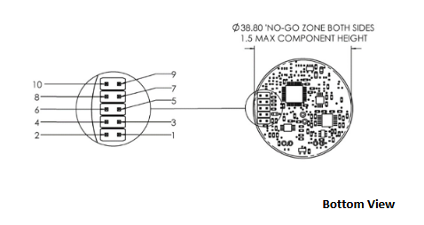

# ROS1 package for COZIR-A CO2 sensors  
  
  
  
This repository is a ROS1 package containing Python scripts to interface with the COZIR-A CO2 sensors using a raspberry pi board. The repository contains two key files, namely `cozirCalibrate.py` and `cozirSensor.py`. The calibration script is designed to calibrate the sensors using fresh air while the sensor is placed in an unobstructed environment. The Sensor script is designed to publish a stamped concentration measurement reading of the CO2 concentration in PPM.  
  
# Setting up the COZIR-A sensor  
  
This setup documentation is focused on the COZIR-A sensors. Based on the available sensor datasheet, the COZIR-A sensor should be connected to the Raspberry pi using GPIO pins. As shown in the following figures, the sensor pins 1 (`GND`),  3 (`VDD`),  5 (`Rx_In`) and 7 (`Tx_Out`) should be connected to pins 6 or 14 (`GND`), 1 (`3v3`), 8 (`GPIO TXD`) and 10 (`GPIO RXD`) of the Raspberry Pi, respectively. 

|  |
| :----------------------------: |
| Cozir Sensor Closed            |

|  |
| :-------------------------------: |
|   Cozir Sensor Uncased            |

|  |
| :-----------------------------------------------: |
|                     Raspberry Pi GPIO pinout      |

-----------------

The COZIR-A sensors are equipped with multiple modes of operation, where the default being the ___streaming mode___(mode 1). This may cause some boot issue on Raspberry Pi if the sensor is directly connected through the GPIO pins, especially with Ubuntu 20.04 and above OS. Therefore, it is advised to "configure" the sensors to operate in ___polling mode___(mode 2) before setting them up with a Pi. In order to configure a COZIR-A sensor, you would need a UART-2-USB adapter, breadboard jumper cables and a laptop/desktop. Connect the UART-USB adapter to the CO2 sensor while ensuring its pin 1, 3, 5, and 7 are connected to `GND`, `3V3` power,`TXD` and `RXD` of the UART-USB adapter. Open Ubuntu terminal on the laptop and type 
```
ls /dev
``` 
to obtain the list of serial associated with current devices. Now plug the USB end of the UART-USB adapter setup with the sensor into the laptop. Repeat the command `ls /dev` to obtain the port name corresponding to sensor.  

Open another terminal with a Python environment and run the following commands to set the sensor configuration to ___polling mode___ (mode 2)
```
import serial
ser = serial.Serial("<insert-the-USB-port-associated-with-sensor>")
ser.write("K 2\r\n".encode("utf-8"))
resp=ser.read(10)
print("Operation Mode: {}".format(int(resp[3:8])))
```

Once the sensor is configured to not stream data, it will not interfere with boot procedure of the Pi.

# ROS1 package Installation
To install the `cozir` ROS-1 package, clone the GitHub repository using the following command in the `src` folder for your catkin workspace

```
git clone https://github.com/LU-Centre-for-Autonomous-Systems/cozir.git
```

Build your catkin workspace by running  `catkin_make` in your catkin workspace. This will build the sensor package and allowing the ROS commands to execute the launch scripts.

# Calibration

In order to run the calibration script, first place the senor setup in fresh air for 15 minutes and allow time for the sensor temperature to stabilize, and for the fresh air to be fully diffused into the sensor. Power up the Pi-sensor setup, and run the calibration Python script using the following command

```
rosrun cozir cozirCalibration.py
```
The calibratin scripts reference fresh air CO2 concnetrations to 400 PPM as a reference value. In future, additional scripts will be added to allow user specific concentration based calibration of the sensor.

# ROS implementation instructions

A independent ROS node for the sensor can be setup by launching the `cozir.launch` file using the following
```
rosrun cozir cozirSensor.py <add-output-type> <add-filter-parameter>
```

Alternatively, in order to add a rosnode to an existing launch file the following can be added to a launch file
```
<node pkg="cozir" type="cozirSensor.py" name="cozirSensor" output="screen" args="<add-output-type> <add-filter-parameter>"/>
```

The `<add-output-type> = filtered or unfiltered` input specifying the whether published measurements on the ROS network are filtered or unfiltered. Moreover, the `<add-filter-parameter>` (chosen from 1 to 32 ) quantifies the sensitivity of the sensor output to sudden concentration changes. A lower the parameter value would result in a more sensitive sensor output. In case no input is provided, the output type is set to filtered with a default parameter value of 16.

# Enabling Serial ports for interfacing

To enable serial port interfacing with the sensor with a Debian OS, follow the following
```
sudo raspi-config
```
Select the serial interface options from the menu, followed by answering NO to enabling login shell and yes to serial hardware port. Finally, reboot the system.

----------

For Ubuntu 20.04 server installations, follow these steps as directed on a [StackExchange](https://askubuntu.com/a/1338744)  query
1. Back up the original `config.txt` and `cmdline.txt` files
```
sudo cp -pr /boot/firmware/cmdline.txt /boot/firmware/cmdline.txt-orig
sudo cp -pr /boot/firmware/config.txt /boot/firmware/config.txt-orig
```
2. Edit `/boot/firmware/config.txt` to comment out the `enable_uart=1` like below,

```
#enable_uart=1
    
cmdline=cmdline.txt
```

3. Remove the console setting `console=serial0,115200` from `/boot/firmware/cmdline.txt`

4. Disable the Serial Service which used the UART
```
sudo systemctl stop serial-getty@ttyS0.service
sudo systemctl disable serial-getty@ttyS0.service
sudo systemctl mask serial-getty@ttyS0.service
```

5. Add the user which will use the UART to `tty` and `dialout` group

```
sudo adduser ${USER} tty
sudo adduser ${USER} dialout
```

6. Finally, reboot Ubuntu 20.04, `/dev/ttyS0` should be available to interface with the sensor.
