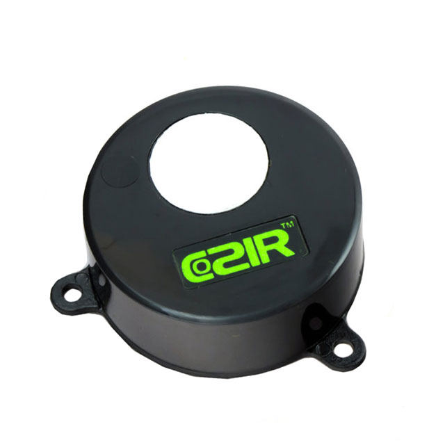

# ROS1 package for COZIR CO2 sensors  
  
  
  
This repository is a ROS1 package containing Python scripts to interface with the COZIR CO2 sensors using a raspberry pi board. The repository contains two key files, namely `cozirCalibrate.py` and `cozirSensor.py`. The calibration script is designed to calibrate the sensors using fresh air while the sensor is placed in an unobstructed environment. The Sensor script is designed to publish a stamped concentration measurement reading of the CO2 concentration in PPM.  
  
# Setting up the COZIR sensor  
  
This setup documentation is focused on the COZIR-A sensors. Based on the available sensor datasheet, the COZIR-A sensor should be connected to the Raspberry pi using GPIO pins. As shown in the following figures, the sensor pins 1 (`GND`),  3 (`VDD`),  5 (`Rx_In`) and 7 (`Tx_Out`) should be connected to pins 6 (`GND`), 1 (`3v3`), 8 (`GPIO TXD`) and 10 (`GPIO RXD`) of the Raspberry Pi, respectively. 

|  |
| :------------------------------------------------------------------: |
|                         Cozir Sensor Closed                          |

|  |
| :------------------------------------------------------------------: |
|                         Cozir Sensor Uncased                         |

|  |
| :-----------------------------------------------: |
|                     Raspberry Pi GPIO pinout      |

# ROS1 package Installation
To install the `cozir` ROS-1 package, clone the GitHub repository using the following command in the `src` folder for your catkin workspace

```
git clone https://github.com/LU-Centre-for-Autonomous-Systems/cozir.git
```

Build your catkin workspace by running  `catkin_make` in your catkin workspace. This will build the sensor package and allowing the ROS commands to execute the launch scripts.

# Calibration

In order to run the calibration script, first place the senor setup in fresh air for 15 minutes and allow time for the sensor temperature to stabilize, and for the fresh air to be fully diffused into the sensor. Power up the sensor, and run the calibration Python script using the following command

```
rosrun cozir cozirCalibration.py
```

# ROS implementation instructions

A independent ROS node for the sensor can be setup by launching the `cozir.launch` file using the following
```
rosrun cozir cozirSensor.py <add-output-type> <add-filter-parameter>
```

Alternatively, in order to add a rosnode to an existing launch file the following can be added to a launch file
```
<node pkg="cozir" type="cozirSensor.py" name="cozirSensor" output="screen" args="<add-output-type> <add-filter-parameter>"/>
```

The `<add-output-type> = filtered or unfiltered` input specifying the whether published measurements on the ROS network are filtered or unfiltered. Moreover, the `<add-filter-parameter>` (chosen from 1 to 32 ) quantifies the sensitivity of the sensor output to sudden concentration changes. A lower the parameter value would result in a more sensitive sensor output. In case no input is provided, the output type is set to filtered with a default parameter value of 16.